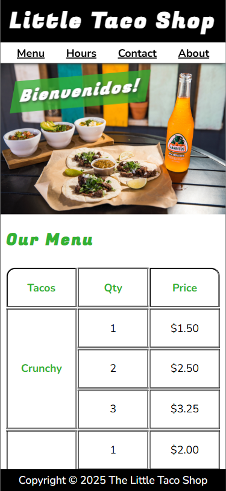
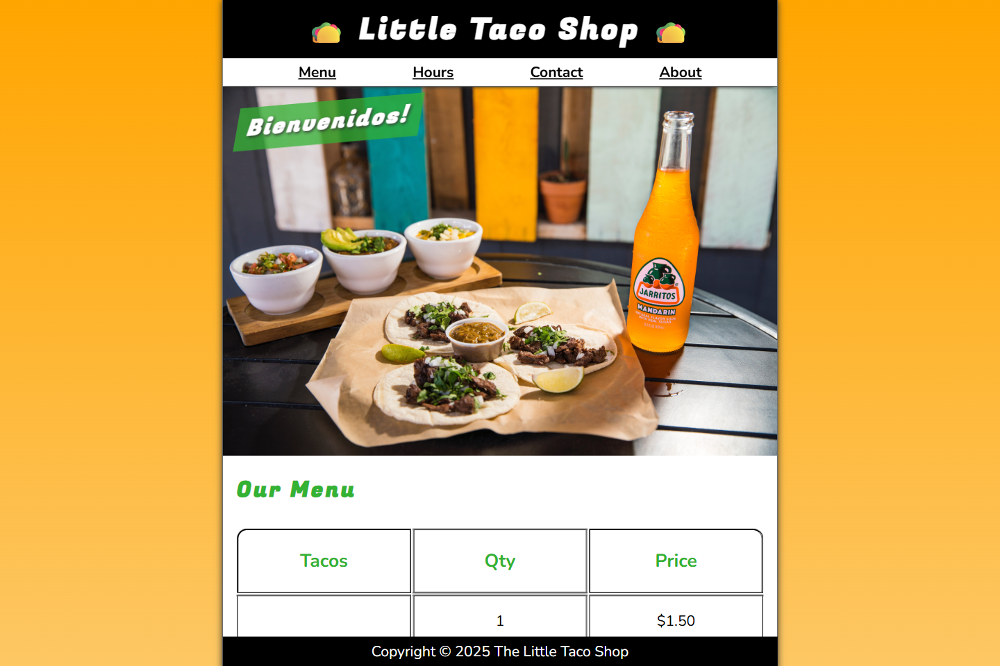
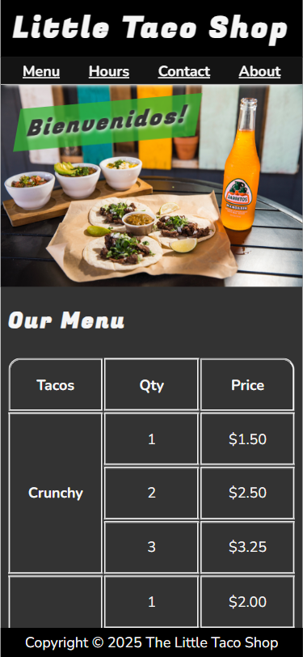
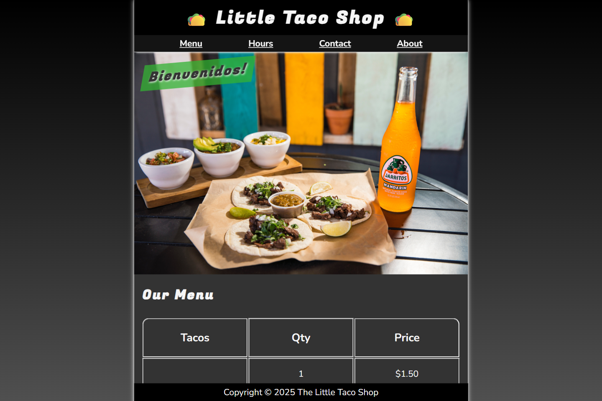

# 💻 The Little Taco Shop Website v2

## ℹ️ Multi-Page Taco Shop Demo Website

| _Mobile Preview (375x812)_                               | _Desktop Preview (1440x960)_                                |
| -------------------------------------------------------- | ----------------------------------------------------------- |
|       |       |
|  |  |

A multi-page fictional restaurant website built with semantic HTML5 and custom CSS. This project simulates a real-world business layout with homepage, about, contact, and hours pages, showcasing layout techniques, inter-page navigation, and accessible form handling.

---

## 🔍 Overview

This project contains a 4-page HTML site styled with custom CSS, including a homepage with a dynamic taco menu, an about page with trivia, a contact form, and a store hours section. It demonstrates practical use of tables, forms, responsive design, reusable classes, and minimal JavaScript for dynamic year insertion.

This project was created as part of a self-directed HTML & CSS learning track, not for commercial use.

---

## ✨ Features

- Semantic multi-page layout (Home, Menu, About, Contact, Hours)
- Store hours with `<dl>` structure
- Taco menu using `<table>` and custom grid-based layout
- Contact form using semantic form elements and logical labels, ready for backend or JS validation.
- Reusable sticky header and footer across pages
- Responsive design using media queries and clamp units
- Themed UI with CSS variables and dark mode support
- Accessible structure using alt, label, and fieldset properly
- Dynamic footer year via minimal JavaScript
- Animations with `@keyframes` and transition timing

---

## 📚 Included Pages

- index.html – Homepage with taco menu
- about.html – About the shop and taco trivia
- contact.html – Location and contact form
- hours.html – Business hours

---

## 🧠 What I Learned

- How to create a multi-page static site and link them seamlessly
- Designing a responsive layout using CSS Grid and Flexbox
- Implementing a stylized table with complex cell arrangements
- Using semantic tags for accessibility and readability
- Creating a basic contact form with clear labels and input structure
- Applying dark mode styles using `@media (prefers-color-scheme)`
- Using CSS custom properties for consistent theming
- Adding animation with keyframes and controlling element flow with position: sticky

---

## 🛠️ Tech Used

- HTML5
- CSS3
- JavaScript (minimal)
- Git
- GitHub
- Netlify

---

## 🚀 How to Run

1. Clone the repository
2. Open `index.html` in your browser

---

## 🌐 Live Demo

Or you can check out the 👉 [live website here](https://the-little-taco-shop-v2-jiro.netlify.app/)

---

## 🧑‍💻 Author

Created by **Elmar Chavez**

🗓️ Month/Year: **April 2025**

📚 Journey: **1st** month of learning _frontend web development_.
